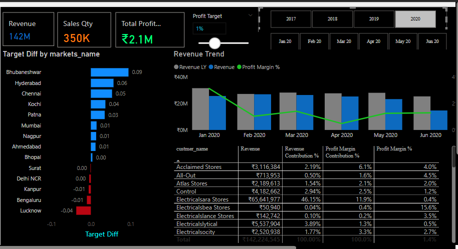

# AtliQ_Hardware_Sales_Analysis
This Power BI project provides business performance insights for AtliQ Hardware ; an India-based company supplying computer hardware across multiple regions.  The project helps stakeholders identify sales trends, regional performance, and profit analysis using clean, interactive dashboards.

#  Sales Analysis Dashboard (Power BI Project)

A comprehensive Power BI project focused on uncovering actionable insights from sales data. This analysis supports business decision-making, highlights underperformance, and identifies growth opportunities.

---

##  Problem Statement

The company was growing dynamically but faced a decline in sales. The goal was to build an automated dashboard to:
- Discover hidden sales trends
- Support faster decision-making
- Reduce time spent on manual data gathering

---
## 📊 Dashboard Preview

Here are some key screenshots from the Power BI dashboard:

###  Business Overview

[](Screenshots/Business%20Performance%20Overview.PNG) 
---


### 2020 Business Performance Insights

[](Screenshots/2020_Business_Performance.PNG)


###  Profit Analysis

[](Screenshots/Profit%20Analysis_2020.PNG)
  
---

##  Tools & Technologies
- **Power BI** (DAX, Power Query, Visuals)
- **MySQL** (ETL & validation)
- **Star Schema** Data Modeling
- Manual ETL pipeline for data cleaning, transformation, and loading

---

##  Workflow Summary

### 1. Data Preparation
- MySQL used for querying raw transactional data
- Data cleaned and normalized (e.g., currency conversion from USD to INR)
- Duplicates and invalid values filtered (e.g., `sales_amount <= 0`)
- Used Power Query for final transformation steps

### 2. Data Modeling
- Star Schema: 1 fact table (`sales_transactions`) and multiple dimension tables
- Relationships created in Power BI for accurate filtering

### 3. DAX Measures
- `Revenue`, `Sales Qty`, `Profit Margin %`, `Profit Margin Contribution %`
- Custom profit margin goal comparisons using dynamic input (slider)

---

## Dashboard Features

- Interactive year filter (e.g., 2020)
- Market-level analysis with bookmarks for region-specific views
- Top 5 customers and products
- Revenue and profit trends by month/year
- Target profit margin simulation
- Visual insight into profit contribution by customer and market

---

##  2020 Key Insights

- **Top Customer**: Electricalsara Stores (46.1% of revenue, 50.6% of profit)
- **Profit Drop**: Margin declined from 4% (Jan) to 0.9% (Apr) despite steady revenue
- **Loss-making Markets**: Lucknow and Bengaluru consistently underperformed
- **Emerging Markets**: Bhubaneshwar (+0.09), Hyderabad (+0.06) exceeded targets
- **Balanced Performance**: Mumbai (14.1% revenue, 12.1% profit)
- **Client Efficiency**: Atlas Stores had better margins than higher-volume clients
- **Low-Profit Customer**: Electricalssale Stores – zero profit despite revenue

---

##  Key SQL Queries & DAX Measures

This section explains the logic behind each SQL and DAX used in the project.

---

###  MySQL Queries

```sql
-- Filters out transactions where sales amount is less than or equal to zero
SELECT * FROM sales_data
WHERE sales_amount > 0;
```
```{sql}
-- Converts sales amount from USD to INR using a fixed exchange rate (82.5)
SELECT *, (sales_amount * 82.5) AS sales_amount_inr
FROM sales_data;
```
-- Creates a star schema view by joining orders with customers and products
-- This prepares a fact table with relevant dimension fields
```{sql}
CREATE VIEW sales_transactions AS
SELECT
    o.order_id,
    o.customer_id,
    o.product_id,
    o.sales_amount,
    c.city,
    p.category
FROM orders o
JOIN customers c ON o.customer_id = c.customer_id
JOIN products p ON o.product_id = p.product_id;
```

## DAX Measures
```{sql}
-- Calculates total revenue in INR
Revenue = SUM('sales_data'[sales_amount_inr])
```
```{sql}
-- Calculates total quantity of items sold
Sales Qty = SUM('sales_data'[quantity])
```
```{sql}
-- Calculates profit margin as a percentage of revenue
-- Handles division-by-zero by returning 0 if denominator is zero
Profit Margin % =
DIVIDE(
    SUM('sales_data'[profit]),
    SUM('sales_data'[sales_amount_inr]),
    0
)
```
```{sql}
-- Calculates the percentage contribution of a specific segment’s profit
-- Uses ALL() to remove filters and get total profit across the dataset
Profit Margin Contribution % =
DIVIDE(
    SUM('sales_data'[profit]),
    CALCULATE(SUM('sales_data'[profit]), ALL('sales_data')),
    0
)
```
```{sql}
-- Shows how far the current profit margin is from the user-defined target
Profit Goal Gap % =
[Profit Margin %] - [Target Profit Margin]
```
##  Project Structure
/Project Root
│
├── /Data
│   └── Contains SQL files used for data extraction and manipulation.
│       └── *.sql
│
├── /Sales_Analysis.pbix
│   └── The Power BI file for the sales analysis dashboard.
│       └── Sales_Analysis.pbix
│
├── /Sales_Analysis_Insights
│   └── Insights extracted from the analysis with images and screenshots.
│       └── /Screenshots
│           └── Contains images and screenshots of key insights.
│
├── /Sales_Analysis_Dashboard_Report.pdf
│   └── The final PDF report summarizing the analysis and insights.
│       └── Sales_Analysis_Dashboard_Report.pdf

### Explanation of Folders and Files:

- **/Reports**: Contains the main Power BI report file, along with queries and DAX measures, and screenshots of the dashboard.
- **/Insights**: Includes multiple folders, each containing Power BI files for different sets of insights.
- **/Data**: Holds the single dataset used for analysis (raw data).


---


